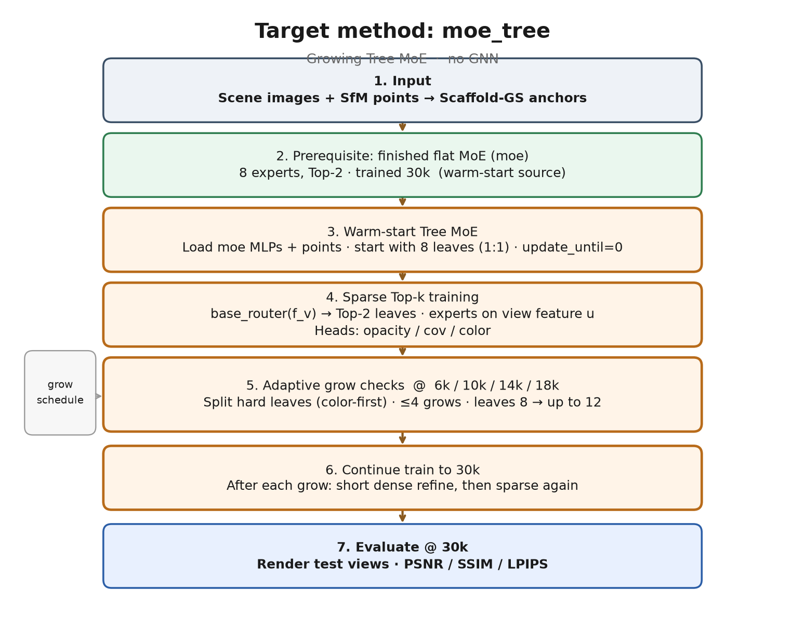
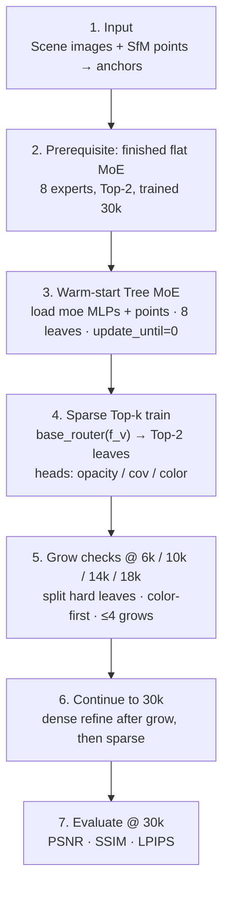

# Target method workflow: `moe_tree`

Growing Tree MoE — **no GNN**.




```mermaid
flowchart TB
  A["1. Input<br/>Scene images + SfM points → anchors"]
  B["2. Prerequisite: finished flat MoE<br/>8 experts, Top-2, trained 30k"]
  C["3. Warm-start Tree MoE<br/>load moe MLPs + points · 8 leaves · update_until=0"]
  D["4. Sparse Top-k train<br/>base_router(f_v) → Top-2 leaves<br/>heads: opacity / cov / color"]
  E["5. Grow checks @ 6k / 10k / 14k / 18k<br/>split hard leaves · color-first · ≤4 grows"]
  F["6. Continue to 30k<br/>dense refine after grow, then sparse"]
  G["7. Evaluate @ 30k<br/>PSNR · SSIM · LPIPS"]

  A --> B --> C --> D --> E --> F --> G
```

**Run**

```bash
# needs a finished moe run first
bash train_method.sh --method moe_tree -d <scene> -g 0
```
